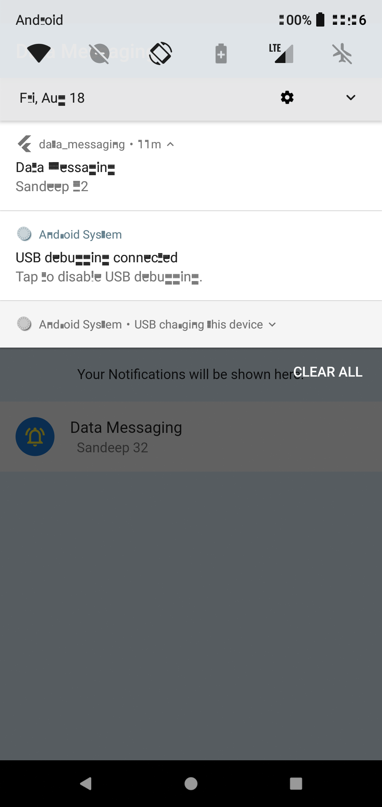

# Data Messaging using FCM

# Flutter MVVM Design Pattern Example

This repository showcases a Flutter project that implements the Model-View-ViewModel (MVVM) design pattern. MVVM is a powerful architectural pattern that enhances code organization, reusability, and testability.

## Folder Structure

The project is organized using the MVVM folder structure. Each folder contains specific components that contribute to the overall implementation of the MVVM pattern:

- `lib/`
  - `models/`
    - `notification_model.dart`: Defines the `NotificationModel` class, which represents notification data.
      - The `NotificationModel` class contains properties such as `title` and `body` to hold notification details.

  - `viewmodels/`
    - `notification_viewmodel.dart`: Implements the `NotificationViewModel` class to manage notification logic and app state.
      - The `NotificationViewModel` class is responsible for interacting with the Model and handling business logic.
      - It initializes the FlutterLocalNotificationsPlugin and handles Firebase messaging events.
      - Manages text editing controllers for input fields.

  - `views/`
    - `my_home_page.dart`: Contains the `MyHomePage` widget that interacts with the `NotificationViewModel`.
      - The `MyHomePage` widget builds the UI for the main screen, including text input fields and a submission button.
      - It uses the `Provider.of<NotificationViewModel>` to access the ViewModel's functionality.
      - Scaffold, TextFormFields, and ElevatedButton widgets are used for the UI elements.

  - `main.dart`: The application entry point, where the `ChangeNotifierProvider` provides the `NotificationViewModel`.
    - The `ChangeNotifierProvider` wraps the entire application with the `NotificationViewModel`, enabling data sharing between components.

## Application Showcases

## Getting Started

To run the project:

1. Install Flutter and Dart using the [official installation guide](https://flutter.dev/docs/get-started/install).
2. Clone this repository to your local machine.
3. Navigate to the project's root directory.
4. Run `flutter pub get` to install dependencies.
5. Launch an emulator or connect a physical device.
6. Run `flutter run` to start the app.

Note: Since last one week my laptop is not with me, that why I wasn't able to connect real device with the as I have developed with on organisation laptop, we're not allowed to connect any devices to that laptop, Due to which you may not see the notification properly, that's why I have rendered that notification in the main screen.
I was going through the last use case that notification should not be shown when app is in background but I didn't found any way to implement that. It will take time to implement.

Thank you.